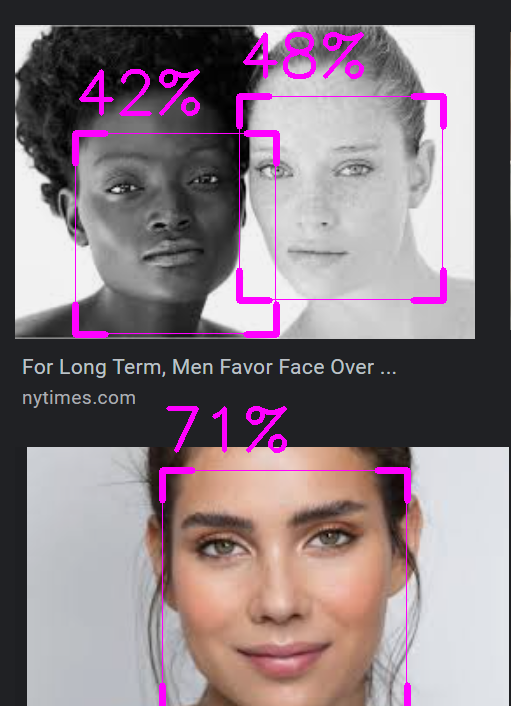

# FaceDetection

Implements Google machine learning algorithm to detect faces on your screen.

* Easy to implement into your code
* Organized and clean code to allow for enhanced readability 

## Images

